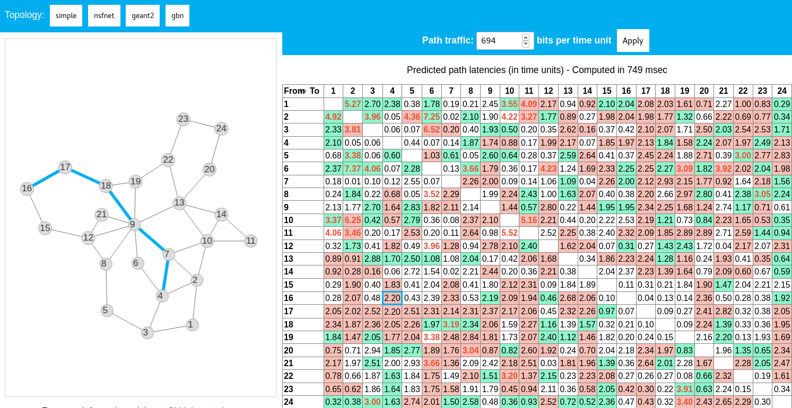

# ITU-ML5G-PS-014-Steredeg

ITU AI/ML in 5G Challenge 2020 submission for Steredeg team (InterDigital / Université Rennes 1, INRIA, IRISA)

## Documentation

This repository contains the [presentation](slides.pdf) made during the ITU Grand Challenge Finale (16/12/2020).

A [report](report.pdf) is also provided with details on the proposed solution and its evaluation.

## Source code

To access the source code, please contact christoph.neumann by email at interdigital.com.

